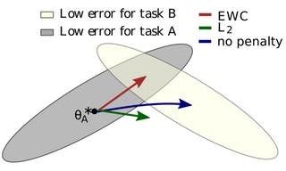
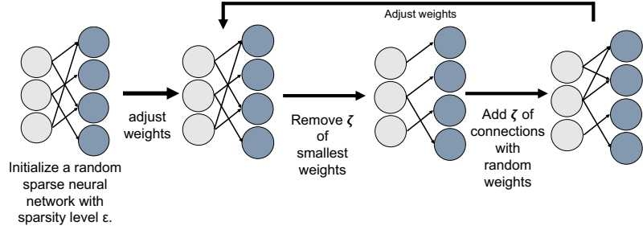
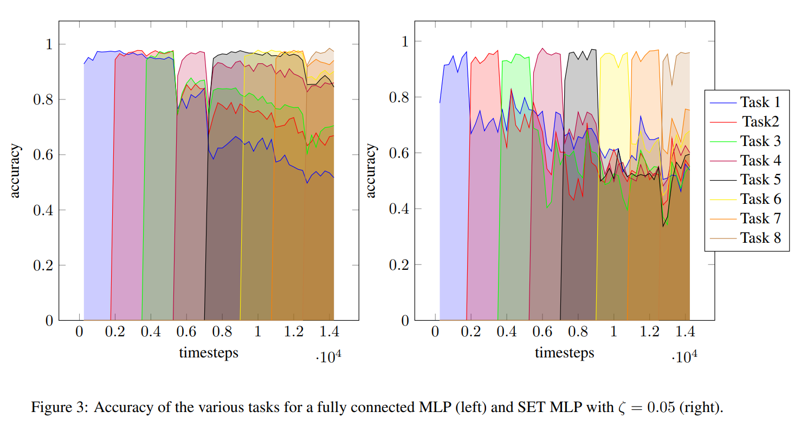

# Overcoming Catastrophic Forgetting with Sparse Evolutionary Training
This code adopts the implementation of Elastic Weight Consolidation [Overcoming Catastrophic Forgetting, PNAS 2017](https://arxiv.org/abs/1612.00796) by Ha Junsoo [@kuc2477](https://github.com/kuc2477) and combines it with [Sparse Evolutionary Training](https://www.nature.com/articles/s41467-018-04316-3) (SET) to investigates what the effects of dynamic sparsity are on EWC and whether Sparse Evolutionary Training (SET) can reduce parameter count while still overcoming catastrophic forgetting. For more information refer to the [paper](EWC-SET_paper.pdf) created for the Information Theory & Statistics course. 

 
## Results

Continual Learning **EWC without SET** (*left*) and **EWC with SET** (*right*).

## Reference
- [Overcoming Catastrophic Forgetting, PNAS 2017](https://arxiv.org/abs/1612.00796)
- [Sparse Evolutionary Training](https://www.nature.com/articles/s41467-018-04316-3)
